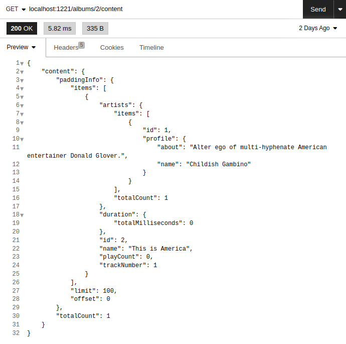

# Lisa
> Backend of Rest-API streaming music service.
## Introduction
This application was written as the first working version of the graduate work "Development of a service for storing musical works".
## About
The backend of the service, which is an analogue to other streaming services, is deployed on the user's computer and allows the user to upload any songs to server. The application provides the ability to access and search for songs, albums, artists. Songs are sent to the user in streaming format. The songs themselves are stored in OPUS format to reduce the size of the songs on disk.
## Dependencies

<ul>
<li>g++</li>
<li>make</li>
<li>cmake</li>
<li>Boost</li>
<li>PostgreSQL</li>
<li>FFMpeg</li>
</ul>

## Usage
Clone repository:

```sh
git clone https://github.com/elasparks/Lisa
```

Build project:

```sh
cmake -Bbuild . && cd build && make
```

Run the program:

```sh
./build/bin/lisa
```

## Preview
